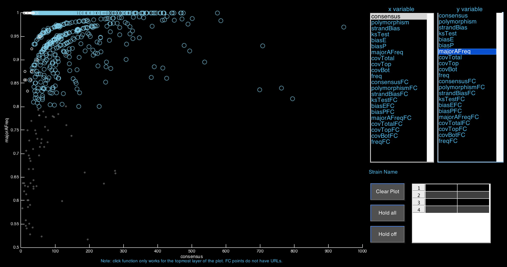
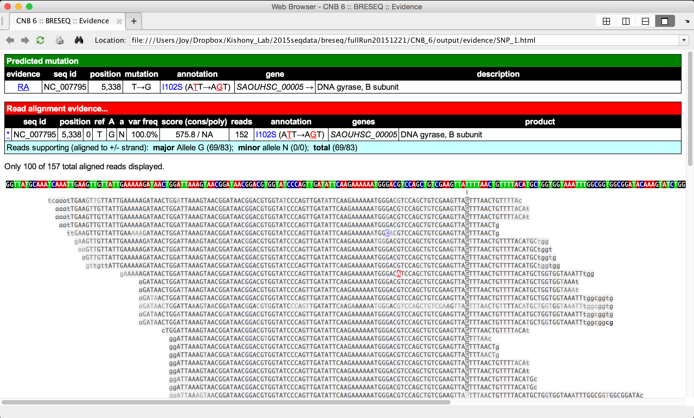
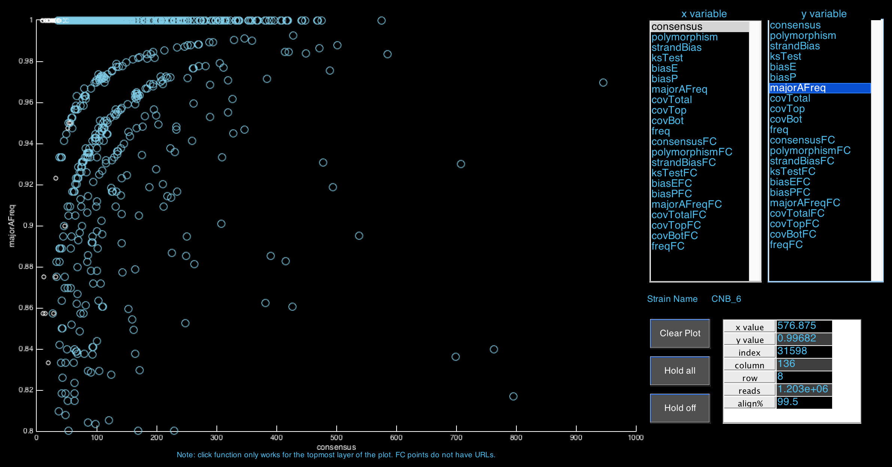
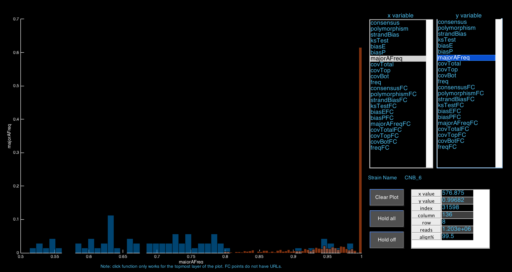

# Genomic Analysis for Bacteria

This repository provides scripts used to extend the functionality of [Breseq](https://github.com/barricklab/breseq), a popular package for finding mutations in DNA sequence data from bacteria and yeasts.

* **breseqPostProcess** contains scripts used to parse and collate breseq output data for large datasets containing hundreds to thousands of strains. It pulls out all parameters (such as polymorphism and consensus scores) for every DNA variant found in at least one strain by breseq. This process is important for quality control.

* **samtoolsForceCall** takes a list of mutations (locations and alterations in the genome) and a list of strains (paths to bam files), and returns alternate read count and frequency for every mutation in every bam file. Scripts in this directory can be easily adapted to other pipelines outside of breseq.

* **matlabGUI** Downstream processing and visualization in Matlab. Unlike the previous two directories, scripts in this directory are project-specific. It includes a nice **interactive GUI** which takes the output files of **breseqPostProcess**, fully integrating the outputs of breseq, and allows users to visualize relationships between different breseq parameters in their sequencing data.

A screenshot of the breseq viewer is below. Breseq parameters are displayed on the right part of the window. Any parameter can be scattered with respect to another by choosing it as either the x or y variable. Parameters with the "FC" suffix indicate these parameters are of variants that did not pass all breseq filters, but were parsed from **breseqPostProcess**.

The plot on the right displays "FC" parameters as gray dots (variants not passing all filters), and "real" variants (passing all filters) as blue dots.

Clicking on any blue dot brings up the breseq HTML page, which displays information on the mutation as well as read alignments.

Clicking on a particular point will also display relevant data on the lower right corner of the window.

Choosing the same variable for the x and y coordinates draw histograms for the parameter values.

